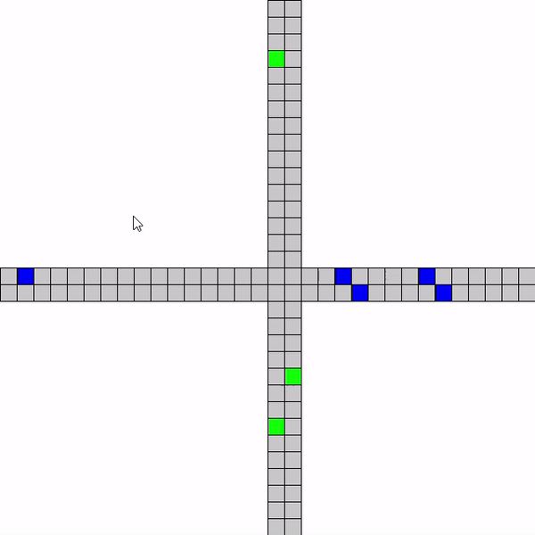

# TrafficModel
An application displaying a traffic model
For car moving was used Nagel-Schrekenberg model

## 
This project is a prototype of [Traffic-flow-Cellular-Automata](https://github.com/RomanKotybeev/Traffic-flows-Cellular-Automata).
I got stucked with furhter coding to implement cellular automata. However, It is my first time to realize OOP. 

In this project I have two abstract classes Road and Car. Car is a class to get common attributes such as velocity, position and motion. Road class is for creating and displaying cars and lanes. Concrete classes inhereted these commonalities but consists of vertical (Y-axis) and horizontal (X-axis) roads and cars which moves backward and forward.

